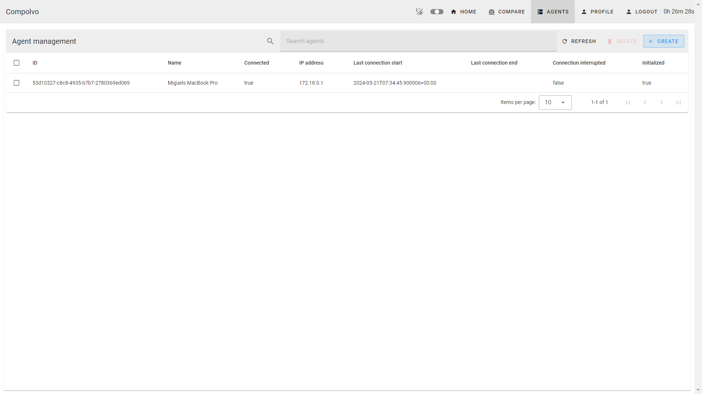
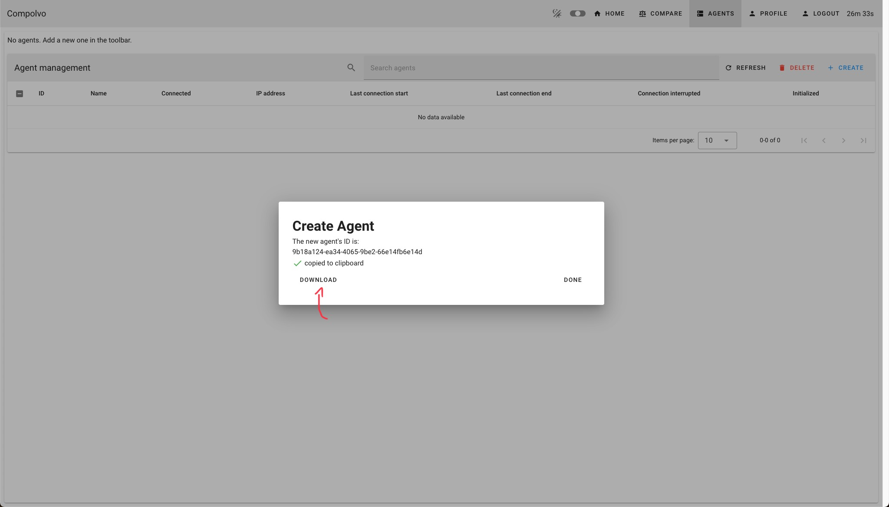

# User Guide for Compolvo

Welcome to the Compolvo User Guide. This guide will walk you through the various pages and functionalities of the
Compolvo website, as displayed in the images provided.

#### Table of Contents

* [1. Page Overview](#1-page-overview)
    * [1.1 Welcome Page](#11-welcome-page)
    * [1.2 Login Page](#12-login-page)
    * [1.3 Registration Page](#13-registration-page)
    * [1.4 Homepage](#14-homepage)
    * [1.5 Software Comparison](#15-software-comparison)
    * [1.6 Software Details](#16-software-details)
    * [1.7 Agent Management](#17-agent-management)
* [2. User Flow](#2-user-flow)

---

## 1. Page Overview

### 1.1 Welcome Page


- **Description**: The homepage welcomes users to the Compolvo site with a logo and a welcome message in German, "
  Willkommen auf der Compolvo-Seite!".
  This is a static welcome page with no interactive elements. To proceed, log in to your account. Once logged in, use
  the navigation bar that appears to explore the website.

---

### 1.2 Login Page


- **Description**: This page allows users to log into their accounts.
- **Fields**:
    - **E-Mail**: Enter your registered email address.
    - **Password**: Enter your password.
- **Buttons**:
    - **Submit**: Logs the user into the system.
    - **No account yet?**: Redirects to the registration page.

---

### 1.3 Registration Page


- **Description**: This page is for creating a new user account.
- **Fields**:
    - **First name**: Enter your first name.
    - **Last name**: Enter your last name.
    - **E-Mail**: Enter your email address.
    - **Password**: Create a password (must be at least 10 characters long).
    - **Repeat password**: Re-enter the password for confirmation.
- **Buttons**:
    - **Submit**: Registers the new user.

---

### 1.4 Homepage


- **Description**: The main page and shows a dashboard for logged-in users. If a software is installed by this website,
  its current status is shown.
- **Features**:
    - **Greeting**: Personalized greeting message.
    - **Dashboard**: Shows the status of the installed software (installed, update available, corrupted) and lets you
      uninstall or update it.
- **Navigation Bar**:
    - **Dark Mode**: Toggle between light and dark mode.
    - **Homepage**: This page.
    - **Compare Tab**: Directs to the software comparison page.
    - **Agent Panel**: Allows adding and seeing the status of agents.
    - **Profile**: Shows the user profile and edit options.
    - **Login/Logout**: Lets you log in or log out.
    - **Session Timer**: Shows a countdown of the current session time. After 1 hour, you have to log in again.

---

### 1.5 Software Comparison


- **Description**: This page allows users to compare different software options.
- **Filter Options**:
    - **Tags**: Filter software by tags.
    - **Price**: Adjust the price range filter.
    - **Period**: Select the period (Day, Month, Year).
    - **License**: Filter by software license.
    - **OS**: Filter by operating system.
- **Software List**: Displays various software options with brief descriptions, licenses, OS compatibility, and pricing
  details. Each software card is clickable and routes you to a more detailed view with buying options of the software.

---

### 1.6 Software Details


- **Description**: Detailed view of selected software.
- **Features**:
    - **Software Information**: Comprehensive details about the software, including features, compatibility, and
      security.
    - **Purchase Options**: Users can choose between different subscription plans (e.g., 1 month or 1 year).

---

### 1.7 Agent Management



- **Description**: Manage agents associated with the user's account.
- **Features**:
    - **Agent List**: Displays a list of agents with details such as name, IP address, connection status, and
      timestamps.
    - **Buttons**:
        - **Refresh**: Refreshes the agent list.
        - **Delete**: Deletes selected agents.
        - **Create**: Adds a new agent.
    - **Agent ID**: After creating a new agent, the agent ID is saved to your clipboard. Use this ID to connect your
      locally installed agent to the website, allowing you to manage installations on your computer through the website.

---

## 2. User Flow

This section describes the overall user flow on the Compolvo website, guiding users from logging in
to managing/buying software and agents.

1. Create an account by clicking on login and select 'No account yet?'
2. After creating a new account, sign in. You will now be greeted by your own customized homepage
3. Next, install the agent on the machine(s) you want to manage. TODO: At the moment this is
   possible via the GitHub repo.
4. Create an agent in the website by clicking on the agents tab in the navbar and then the blue create button
5. The agent id is saved in your clipboard. Run the agent init script on your machine and paste the
   agent id when prompted to.
6. Inside the agents tab you should now see the name and connection information of your installed
   agent (possibly after refreshing)
7. Make sure to run the agent on the agent's machine using the run command.
8. Add your payment details in the profile tab (after clicking on the edit icon)
9. Compare different software options by clicking on the compare tab in the navbar
10. Filter the available softwares by the criteria that are important to you
11. For easier comparison, when you select a time span in the filter, all prices are displayed for the chosen period. If
    a service offering exists for that specific duration, its price is shown. If not, the price is adjusted to fit the
    selected time span. For example, if only a monthly offering is available but you want to compare services over a
    year, the monthly cost is multiplied by 12, or the annual offering is displayed. This ensures a clear and accurate
    comparison across different services for your desired time frame.
12. Select a software to see more details and purchase options
13. Subscribe to software by subscribing to a service offering
14. After positive confirmation, go to the profile tab to install the software.
15. On the home tab, observe the software being installed on the agent.

### Registering an user account

Go to the [https://compolvo.mithem.uk/compolvo](website). You are greeted by the start page:


Optionally, you can select your preferred color scheme by clicking on the theme mode toggle in the
top right corner besides the login button.

Click on login to see the login page:


As, when starting out, you probably don't have an account yet, click on the "No account yet?" link
to be redirected to the registration page:


After filling out your information, click on the submit button to create your account. You will be automatically logged in and redirected to the home page.


### Adding an agent

Dort wird unmittelbar eine Hilfestellung angezeigt, welche weiteren Aktionen für den Benutzer
empfohlen werden, um die Software optimal zu nutzen.
Beim Klick auf "agent panel" wird die Agent-Verwaltung geöffnet. Hier können neue Agents hinzugefügt
und bestehende Agents verwaltet werden:


Wenn der create-Button gedrückt wird, wird ein Dialogfenster angezeigt, welches die ID des neu
erstellten Agents anzeigt:

Diese wird automatisch zur Zwischenablage des Benutzer-Rechners kopiert. Sie wird nun zur
Initialisierung des Agents benötigt.

### Initializing the agent

Da auf dem Rechner, der verwaltet werden soll, noch kein Agent installiert ist, muss dieser zunächst
heruntergeladen werden.
Dazu kann der "download"-Knopf gedrückt werden. Dieser zeigt dann ein Fenster an, in dem der Agent
für die jeweilige Umgebung heruntergeladen werden kann:

Anschließend wird eine ausführbare Datei für das jeweilige System heruntergeladen.

Der Benutzer führt die entsprechende Datei aus und gibt als Argument den Befehl `init --compolvo-host compolvo.mithem.uk` an:
In einer Unix-Umgebung also bspw.:

```shell
./compolvo-agent-manjaro-x64 init --compolvo-host compolvo.mithem.uk
```

Das Programm fragt nun nach der Agent-ID, die zuvor in die Zwischenablage kopiert wurde. Außerdem kann ein Name für den Agenten vergeben werden, um die gemanagten Rechner besser unterscheiden zu können.
Damit gilt der Agent als initialisiert und betriebsbereit.


Nun muss der Agent nur noch gestartet werden, damit er auf Befehle zur Installation von Software hören kann.
Dafür muss dieselbe Datei mit dem Argument `run` ausgeführt werden. Damit Software installiert werden kann, muss der Prozess über ausreichende Berechtigungen verfügen. Unter Unix-System kann es also z.B. so ausgeführt werden:

```shell
sudo ./compolvo-agent-manjaro-x64 run
```

Damit ist der Agent empfangsbereit.

### Auswahl von Software

Nun empfiehlt sich ein Blick auf die Software-Übersicht. Dazu kann der Reiter "compare" in der
Navigationsleiste ausgewählt werden:

Hier kann zwischen verschiedenen Software-Optionen gefiltert werden. Die Software kann nach Tags,
Preis, Lizenz, und unterstützten Betriebssystem und weiteren Kriterien gefiltert werden.
Insbesondere kann das Zahlintervall angepasst werden, um die Software-Preise für den gewünschten
Zeitraum zu vergleichen. Falls ein Service nur für einen anderen Zeitraum als ausgewählt angeboten wird, wird der Preis dafür
automatisch umgerechnet.
Sollte für eine Software Kaufinteresse bestehen, können durch einen Klick auf die Karte weitere Informationen angezeigt werden:


### Kauf von Software

Die Kaufoptionen (Abonnement-Pläne) können im unteren Teil angesehen werden.
Beim Klick auf "buy now" bei einem Angebot wird darauf hingewiesen, dass der Benutzer noch nicht über hinterlegte Zahlungsinformationen verfügt und gebeten, diese auszufüllen:


Nach dem Abschicken der Informationen wird der Benutzer zurück zur Service-Detail-Seite weitergeleitet. Nachdem er erneut den Kauf betätigt, wird er aufgefordert, die profile-Seite aufzusuchen.
Beim Klick auf "profile" in der Navigationsleiste kann der Benutzer die bestellte Software sehen:


Nach einem Klick auf "install" können bestehende und kompatible Agents ausgewählt werden, auf denen die Software installiert werden soll:


Nach der Bestätigung wird darauf hingewiesen, die home page zu besuchen.
Dort wird der Installationsprozess der Software auf dem Agenten angezeigt:


Die Software wird nun installiert (sobald der Agent verbunden ist).
Sie kann über dieselben Kacheln, die für die Statusinformation genutzt werden, auch wieder deinstalliert werden.
Abonnements können über die profile-Seite gekündigt werden (was automatisch die Software von allen verbundenen Agents entfernt).